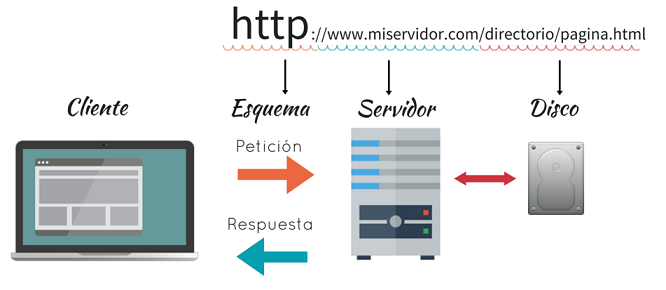
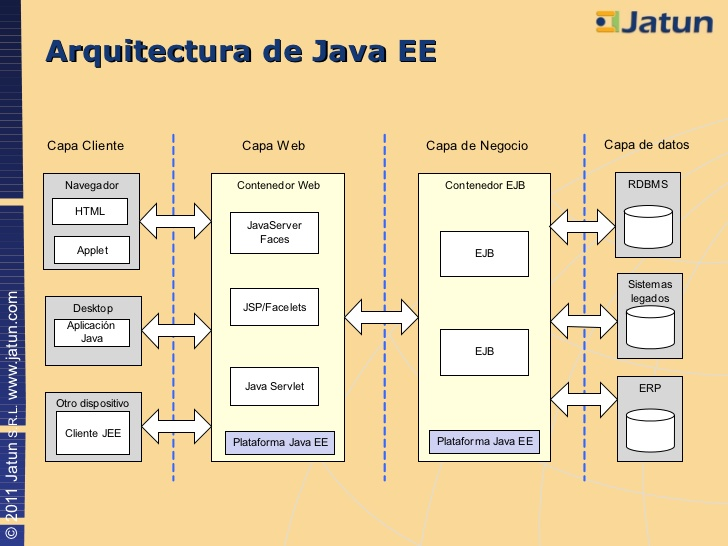

#    Práctica N° 1
## SISTEMAS EMPRESARIALES

### 1) Explique que son los sistemas empresariales

Un sistema empresarial es un sistema central de la organización, que garantiza que la información se pueda transmitir atraves de todas las funciones empresariales, y todos los niveles de gestión, para soportar la operación y administración de una empresa.

### 2) Describa cuales son las características más importantes de una aplicación empresarial
Que principalmente están basados en: La Plataforma tecnológica, Alta disponibilidad,  Escalabilidad, Seguridad y Mantenimiento.
Entre sus características están que tienen:

* Acceso a las **bases de datos**, relacionales. 
* Son **escalables** horizontal y verticalmente
* **Integran** diversas tecnologías
* Son **seguras y disponibles** de manera continua
Como ejemplo: 
* **ERP** -> Sistema de planeación de Recursos Empresariales.

### 3) Investigue y proponga cinco (5) instituciones que requerirían aplicaciones de misión crítica. "Justifique su respuesta"

- **Sub-alcaldía Distrito 4:** Requieren de estas aplicaciones, ya que es necesario tener un sistema, la cual pueda ayudar a los vecinos de este distrito a hacer un seguimiento cercano de lo que son sus papeles. A su vez, influye la escalabilidad ya que siempre se va incrementando nuestra población y requerirá una base de datos mucho más amplia.
- **Carpintería Maestranza:** Ya que esta carpintería, realiza muebles como catres, roperos, sillones y otros. Vemos que es necesario que tenga una plataforma tecnológica, ya que mediante ella podría incrementar su ventas ya sea online o la muestra de sus productos, y aprovechar dicho sistema bajo el concepto de seguridad tener un control de inventarios.
- **Mercado Carmen:** Requiere de una plataforma tecnológica, o su sistema donde les permita tener el control de los papeles de sus asociados al mercado, ya que se vio la deficiencia en que aún son manejados, documentos físicos archivadores, lo cual no es seguro y una mejor opción de poder sistematizarlos, porque este mercado también esta con visión de la escalabilidad.
- **Asociación de Comerciantes Yunguyo:** Basándonos en la escalabilidad como la seguridad, esta asociación requiere de un sistema o una plataforma que les permita a tener información explicita guardada en el sistema de cada asociado, ya que actualmente se maneja en libros físicos, lo cual están en riesgos de que en algún momento puedan ser extraviados.
- **Iglesia “Vida Nueva”:** En el caso de esta institución religiosa, requieren de la plataforma tecnológica, ya que ellos tienen actividades, anuncios, enseñanzas y control de los miembros en cuanto a su asistencia, datos personales y otros. Actualmente son manejados en sus libros de actas, que ya sufrieron algunas perdidas y por lo cual es necesaria la implementación de algún sistema ya que también está sujeto a la misión crítica de que será escalable.

### 4) Explique cuáles son las diferencias entre la escalabilidad horizontal y escalabilidad vertical

1. **Escalabilidad Vertical:** Se refiere al crecimiento del hardware o modernización de los componentes. El esfuerzo de este crecimiento es mínimo, puede ser una solución rápida a un problema pero con la desventaja, que el crecimiento está limitado.
2. **Escalabilidad Horizontal:** Se refiera más al crecimiento o aumento de componentes, puede combinarse con el vertical ya que prácticamente este crecimiento puede ser infinito con la deficiencia de que requerirá mayor mantenimiento.  

### 5) Que es un servidor Web y que es un servidor de aplicaciones

- ***Servidor WEB*** -> Es una computadora que forma -parte de una red, que provee servicios a otras computadoras que son los clientes y que el software que se encarga de despachar el contenido de un sitio web al usuario.
- ***Servidor de Aplicaciones*** -> Es un dispositivo que proporcionan servicios de aplicación a las computadoras de los clientes. Como Weblogic Server y otros

### 6) Con un gráfico explique cómo funciona el protocolo HTTP

Este protocolo, funciona principalmente a través de solicitudes y respuestas entre un cliente y un servidor
A una secuencia de estas solicitudes se las conoce como sesión de HTTP

### 7) Explique los elementos importantes de REQUEST en HTTP
La primera línea es la request line y el resto son cabeceras HTTP
El REQUEST line está formado por 3 partes:

- El método: indica el tipo de petición que se realiza como GET, POST o HEAD
- La ruta: Es parte de la dirección WEB, que está detrás del dominio. 
- El protocolo: Consta de HTTP y el número de versión de protocolo que empieza comúnmente por 1.1
- **Ejemplo :** 
/form.php nombre=Juan&apellidos=Perez&action=Submit HTTP/1.1

### 8) Explique los elementos importantes de RESPONSE en HTTP
Versión del protocolo, código de estado, mensaje de estado, cabeceras http

**LINEA DE ESTADO**, Consta de 2 partes, el protocolo y un condigo numérico de estado seguido de un mensaje breve. Código 200, peticiones GET tuvo éxito
Ejemplo: HTTP/1.1 200 OK

### 9) Describa con un gráfico la arquitectura Java EE

###10) Explique cuáles son los contenedores, componentes y servicios de Java EE
**Contenedor WEB** -> Maneja la ejecución de las páginas web, servlets y algunos componentes ejb para las aplicaciones Java EE.

**Contenedor de negocios EJBs** -> Maneja la ejecución de los enterprise beans.
Contenedor de aplicación cliente: Maneja la ejecución de la aplicación cliente no necesita un servidor de aplicaciones.

**Contenedor Applet:** Maneja la ejecución de applets, no necesita servidor de aplicaciones, consiste en un browser y el plugin web de java.
**Componente Cliente** -> Son aplicaciones Java EE (AWT, Swing, Applets), Corriendo la máquina del cliente
**Componente Web** -> Java Seviets, java Server Pages JPS, Corriendo el servidor java EE
**Componente de negocio** -> Enterprise JavaBeans (EJB), Corriendo el servidor java EE
Servicios de Java EE

- ***De directorio:** para la indexación componentes y recursos y búsqueda de componentes y recursos.
- ***De despliegue:*** para poder personalizar los componentes y recursos
- ***De Seguridad***, Para autenticar y autorizar a los usuarios de la aplicación.
De acceso a datos: para facilitar el acceso a Bases de Datos
###11) Investigue los métodos más utilizados de las clases HttpServlet, HttpServletRequest y
***HttpServletResponse***, y para cada uno de los métodos muestre un ejemplo.
public abstract interface Servlet: Todos los servlets implementan este interfaz directamente o extendiendo una clase que lo implemente como HttpServlet. Entre sus métodos están:

•	***init(ServletConfig config):*** Es el método utilizado para crear una nueva instancia del servlet (análogo al constructor). Ver el ciclo de vida. Este método puede ser sobreescrito para realizar tareas como crear una conexión a una BD que se mantendrá mientras el servlet se mantenga cargado y puede ser utilizada por cada petición. ServletConfig contiene los parámetros de inicialización que entrega el servidor al servlet.
•	***getServletConfig():*** Retorna la configuración dada para la inicialización del servlet.

•	***service(ServletRequest req, ServletResponse res):*** Este método es el que se llama cuando se recibe una petición de un cliente y en su implementación normal para HTTP verifica el tipo de solicitud GET, POST, etc. y la redirige a los métodos respectivos. En general no es necesario reimplementar este método.

•	***destroy():*** Este método es llamado por el servidor para indicar que el servlet será destruido. Es llamado sólo una vez y uno debe encargarse de esperar por posibles peticiones en curso. Ver el ciclo de vida.

****Ejemplo.-****  Obtener una Sesión
public class CatalogServlet extends 

> HttpServlet { 
        public void doGet (HttpServletRequest request,
                           HttpServletResponse response)
    	throws ServletException, IOException
        {
            // Get the user's session and shopping cart
	    HttpSession session = request.getSession(true);
	    out = response.getWriter();
        }
    }

***public abstract interface ServletRequest:*** Permite obtener información del cliente que no depende del protocolo, por ejemplo:

***•	getRemoteAddr():*** Retorna la IP del cliente.
***•	getParameter(String name):*** Retorna el valor del parámetro name dado por el cliente.
***•	getInputStream():*** Sirve para crear un canal de comunicación para obtener dados binarios.

***public abstract interface ServletResponse:*** Define un objeto para permitir a un servlet enviar una respuesta al cliente. Proporciona dos formas de devolver datos al usuario.
***•	setContentType(String type):*** Permite definir el tipo de respuesta que se le dará al cliente. Si se retornará una página web deberá ser text/html.
***•	getWriter():*** Retorna un objeto Writer para poder enviar respuestas de texto.

***•	getOutputStream():*** Retorna un objeto ServletOutputStream que permite enviar respuestas binarias al cliente.
public abstract interface HttpServletResponse extends ServletResponse: Permite enviar al cliente respuestas específicas del protocolo HTTP.

***•	addCookie(Cookie cookie):** Para definir nuevas cookies en el cliente.

***•	setHeader(String name, String value):*** Para definir un header HTTP a enviar al cliente.

•	***sendRedirect(String location):*** Envía un mensaje al cliente para redireccionar la respuesta a la dirección señalada.
private void ping(HttpServletResponse resp) throws IOException {
   > if (allowColdRun || metricSearch.isMetricTreeLoaded()) {
        resp.setStatus(HttpServletResponse.SC_OK);
        resp.getWriter().print("0;OK");
        return;
    }
    resp.setStatus(HttpServletResponse.SC_SERVICE_UNAVAILABLE);
    resp.getWriter().println("2;Metric tree not loaded ");
}

